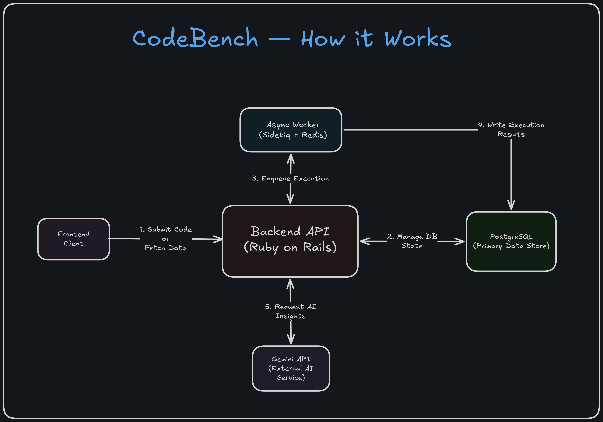

# CodeBench

A code judge that doesn't just check your output — it checks if you understand your solution. Submit Python code, run it in an isolated Docker container, get evaluated against multiple test cases. On accepted, Gemini generates follow-up questions specific to your code and evaluates your answers.




## Demo
https://github.com/user-attachments/assets/8afdcc0c-d4b5-4f59-b3b4-d74a107e8d5d

## How It Works

1. User submits Python code via the React frontend
2. Rails saves the submission and enqueues a Sidekiq job — returns 202 immediately
3. Frontend polls every 2 seconds until status is terminal
4. Sidekiq worker runs the code inside an isolated Docker container per test case
5. Output is compared against all test cases — partial results tracked (e.g. 3/4 passed)
6. On wrong answer: Shows the failing input, your output & expected output
7. On accepted: Gemini generates 3 short follow-up questions specific to your code
8. User has 3 minutes to answer — Gemini evaluates leniently and explains each result

## Architecture

Key decisions:

- **202 + polling** instead of WebSockets — execution takes 2-15s, polling at 2s is simpler and sufficient
- **Docker sandbox** for isolation — no network, memory capped, read-only filesystem, hard time limit
- **Sidekiq** keeps the web process non-blocking during code execution
- **Gemini via raw HTTP** — no SDK needed for a single endpoint
- **SubmissionRecoveryWorker** runs every 5 minutes via Sidekiq cron to re-enqueue stuck `pending` submissions and mark crashed `running` submissions as `runtime_error`

## Sandbox Constraints

Each submission runs in a fresh Docker container with:

| Constraint    | Value                    |
| ------------- | ------------------------ |
| Network       | None                     |
| Memory        | 128MB (swap also capped) |
| CPU           | 0.5 cores                |
| Max processes | 32                       |
| Time limit    | 10 seconds               |
| Filesystem    | Read-only                |

## Submission Statuses

- `accepted`: All test cases passed
- `wrong_answer`: Output mismatch on at least one test case
- `runtime_error`: Non-zero exit code
- `compile_error`: Python SyntaxError detected
- `time_limit_exceeded`: Execution exceeded 10 seconds

## Limitations

- Python 3 only
- Output compared as plain strings — whitespace and formatting matter
- No per-user accounts — submissions are not tied to a user
- Gemini follow-up is synchronous — a slow API response delays the result

## Stack

- **API:** Ruby on Rails 7.2 (API mode)
- **Background jobs:** Sidekiq + Redis
- **Database:** PostgreSQL
- **Execution sandbox:** Docker (python:3.11-alpine)
- **AI follow-up:** Google Gemini 2.5 Flash
- **Frontend:** React + Vite

## Setup & Installation

**Prerequisites:** Ruby 3.2.2, Rails 7.2, PostgreSQL, Redis, Docker

```bash
git clone https://github.com/Alokxk/CodeBench.git
cd CodeBench
bundle install
rails db:create db:migrate db:seed
docker pull python:3.11-alpine
```

Create `.env` in the project root:

```
GEMINI_API_KEY=your_key_here
SIDEKIQ_WEB_PASSWORD=any_password_you_want
SIDEKIQ_WEB_SECRET=generate_and_paste_a_random_secret_here
```

NOTE:

- Run this to generate SIDEKIQ_WEB_SECRET: `ruby -e "require 'securerandom'; puts SecureRandom.hex(32)"`
- Get a free Gemini API key at [aistudio.google.com](https://aistudio.google.com).

## Running the Application

CodeBench requires three separate processes.

```bash
# Terminal 1
rails server

# Terminal 2
bundle exec sidekiq -C config/sidekiq.yml

# Terminal 3
cd frontend && npm install && npm run dev
```

Open `http://localhost:5173` in your browser to access the frontend. You can submit code and see results in real-time.
The Sidekiq dashboard is available at `http://localhost:3000/sidekiq` (password from `.env`).

## Contributing

Contributions are welcome. Please open an issue or submit a pull request. Make sure to follow the existing code style. For major changes, please discuss them in an issue first.
